<p align="center">
  
</p>

<h1 align="center">Hi, I'm cxx.</h1>

<p align="center">
  <strong>I turn ambitious ideas into products that run, feel good, and ship.</strong>
  <br />
  <sub>把复杂想法做成能跑、好用、能交付的产品。</sub>
</p>

<p align="center">
  <a href="https://github.com/928422955?tab=followers">
    
  </a>
  
  
  
</p>

### Current transmission

```ts
const cxx = {
  focus: [
    "AI products",
    "real-time media",
    "desktop experiences",
  ],
  operatingMode: {
    default: "logs > guesses",
    finish: "shipped > perfect",
  },
};
```

### What I build

> **`SIGNAL 01` · AI product systems**
>
> Agent workflows, tool-use experiences, and the product layers around them.

> **`SIGNAL 02` · Live media tooling**
>
> Streaming pipelines, OBS integrations, and audio/video infrastructure.

> **`SIGNAL 03` · Desktop software**
>
> Fast, durable apps that make complicated work feel straightforward.

### Toolbox

<p align="center">
  
</p>

### Contribution signal

<picture>
  <source media="(prefers-color-scheme: dark)" srcset="https://raw.githubusercontent.com/928422955/928422955/output/github-contribution-grid-snake-dark.svg" />
  <source media="(prefers-color-scheme: light)" srcset="https://raw.githubusercontent.com/928422955/928422955/output/github-contribution-grid-snake.svg" />
  
</picture>

<p align="center">
  <sub>Make it work. Make it clear. Ship it.</sub>
</p>
